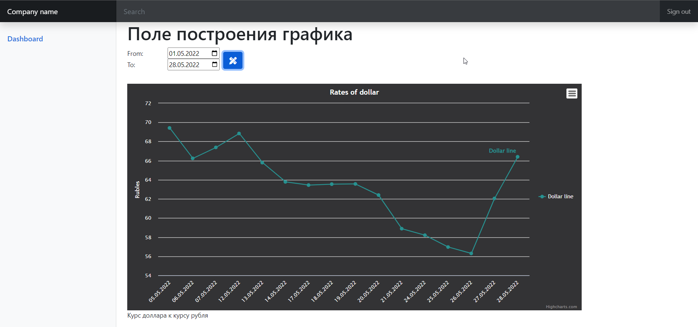

# Task Description
Построить график динамики курса доллара к рублю.
1. В минимальном для этого интерфейсе должен указываться период, за который необходимо построить график.
2. Использовать для визуализации графика библиотеку
   https://www.highcharts.com/
3. Использовать в качестве источника данных
   https://www.cbr.ru/development/sxml/
4. В качестве PHP framework использовать Laravel
5. Присылать в виде ссылки на репозиторий
6. Ключевое - правильная организация кода
# Installation
1. docker-compose build
2. docker-compose up -d
3. docker-compose run --rm php-cli composer install
# Feedback
В целом задание интересное. Поставил себе челлендж, решив сделать рисовку графика через ajax запрос. Общее время выполнения: ~6 часов (без ajax запроса).
# Demo-screen
